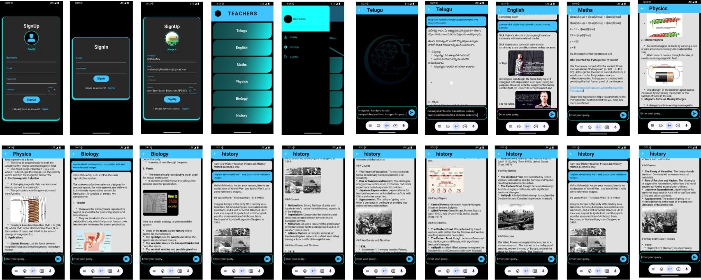

# 📚 AIT – AI Teacher  

AIT is an **AI-powered educational mobile app** built with **Flutter, FastAPI, Firebase, SQLite, and Gemini 2.0 Flash**.  
It’s designed like **WhatsApp for students**, but instead of regular contacts, you have **AI teachers for each subject** who answer your queries in real time.  

## AIT – AI Teacher OverView
<p align="center">  
    
</p>  

---

## 🚀 Features  

- 🔐 **Firebase Authentication** – Secure email & password signup/login with syllabus & grade info.  
- 📚 **Subject-based AI Chats** – Each contact is a dedicated subject teacher.  
- 🧠 **Query Classifier** – Detects whether a query is basic (answered directly by AI) or advanced (scrapes extra content like images/videos from the internet).  
- 💾 **SQLite Database** – Dynamic `user_id.db` creation with subject-wise chat history tables.  
- ⚡ **Real-time Streaming** – Chat messages streamed via WebSocket and rendered with Flutter’s **StreamBuilder**.  
- 🎯 **EdTech Focus** – Makes AI more **useful and practical** for students instead of just raw AI prompts.  

---

## 🛠️ Tech Stack  

- **Frontend**: Flutter  
- **Backend**: FastAPI (Python)  
- **Database**: SQLite (user-specific `.db` files)  
- **Authentication**: Firebase  
- **AI Model**: Gemini 2.0 Flash  
- **Communication**: WebSockets  

---

## 📂 Project Structure  

```bash
/AIT – AI Teacher  
 - /a_i_t           #Forntend
 - /a_i_t_backend   #backend
```

---

## ⚙️ Setup Instructions  

### 1️⃣ Clone the Repository  
```bash
git clone https://github.com/BBB2912/AIT-AI-Teacher.git
cd AIT-AI-Teacher
```

### 2️⃣ Backend Setup (FastAPI)  
```bash
cd a_i_t_backend 
uv run pip install -r requirements.txt
uvicorn main:app --reload
```

### 3️⃣ Frontend Setup (Flutter)  
```bash
cd a_i_t
flutter pub get
flutter run
```

### 4️⃣ Firebase Setup  
- Create a Firebase project.  
- Enable Email/Password authentication.  
- Download `google-services.json` and place it in the Flutter `android/app/` directory.  

---


## 💡 Vision  

I didn’t build a new AI model here. Instead, I **engineered existing AI (Gemini 2.0 Flash)** into a **practical, usable mobile app**. My goal is to make AI **more accessible and useful for education**, helping students learn with interactive subject-specific AI teachers.  

---

## 🙌 Contributing  

Contributions, suggestions, and feedback are always welcome!  
If you’d like to collaborate, feel free to open an issue or pull request.  

---

## 📬 Contact  

👨‍💻 **Developer**: Kakarla Mahendra Kumar Reddy  
🔗 [LinkedIn](https://www.linkedin.com/in/%20mahireddy-kakarla/) | [GitHub](https://github.com/BBB2912)  
